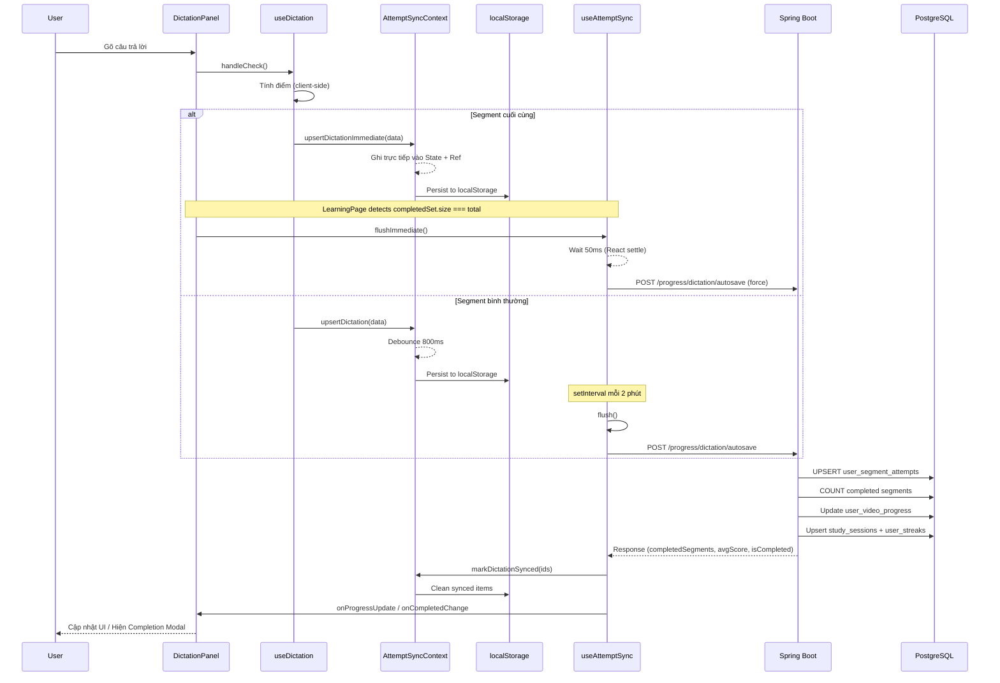

# Autosave Flow Architecture — VocabFlow

> Tài liệu mô tả chi tiết cơ chế tự động lưu tiến độ học Dictation và Shadowing trên Learning Page.

---

## 1. Tổng quan

Tính năng Autosave đảm bảo mọi tiến độ học tập của user (điểm, văn bản đã gõ/nói) được lưu lại tự động mà không cần user nhấn nút "Save". Cơ chế hoạt động theo mô hình **"Buffer → Debounce → Batch Flush"**.

### Tech Stack

| Layer | Công nghệ |
|---|---|
| Frontend State | React Context API (`AttemptSyncContext`) + `useRef` |
| Offline Buffer | `localStorage` (crash recovery & cross-tab sync) |
| API Communication | Axios (normal flush), `fetch` with `keepalive: true` (page unload) |
| Backend | Spring Boot, Spring Data JPA, PostgreSQL |

---

## 2. Kiến trúc Frontend — Sync Engine

### 2.1 Các thành phần chính

```
LearningPage (Orchestrator)
  └─ AttemptSyncProvider (Context — quản lý pending maps)
       ├─ useDictation (Hook — xử lý input & scoring)
       ├─ useSpeechShadowing (Hook — recording & recognition)
       └─ useAttemptSync (Hook — background sync engine)
```

### 2.2 Luồng dữ liệu từ User Input đến API

#### Bước 1: User nhập liệu
- **Dictation**: User gõ phím → `useDictation.handleCheck()` tính điểm → gọi `upsertDictation(segmentId, data)`.
- **Shadowing**: User nói → `SpeechRecognition.onresult` chuyển giọng thành văn bản → gọi `upsertShadowing(segmentId, data)`.

#### Bước 2: Debounce 800ms (AttemptSyncContext)
Mỗi lần `upsertDictation` / `upsertShadowing` được gọi:
1. Timer cũ của `segmentId` đó bị **cancel** (nếu có).
2. Timer mới **800ms** được tạo.
3. Sau 800ms không có thay đổi mới → data được commit vào React State + localStorage.

```
User gõ "H" → timer 800ms
User gõ "He" → cancel timer cũ, timer mới 800ms
User gõ "Hello" → cancel timer cũ, timer mới 800ms
... (800ms trôi qua, không gõ thêm) ...
→ Commit { segmentId, dictationUserText: "Hello", dictationScore: 100, isSynced: false }
```

#### Bước 3: Periodic Flush (useAttemptSync — mỗi 2 phút)
`setInterval` chạy mỗi **120 giây**:
1. Đọc tất cả items có `isSynced === false` từ ref.
2. Chia thành batch (tối đa 50 segments/batch).
3. Gọi API `POST /progress/dictation/autosave` hoặc `/shadowing/autosave`.
4. Nếu thành công → `markDictationSynced(ids)` → set `isSynced = true` → tự động xóa khỏi localStorage.

---

## 3. Các Trigger Flush (5 scenarios)

| # | Trigger | Cơ chế | Ghi chú |
|---|---------|--------|---------|
| 1 | **Periodic (2 min)** | `setInterval(flush, 120_000)` | Luồng chính, fire-and-await |
| 2 | **Page unload** (đóng tab/refresh) | `beforeunload` → `fetch` with `keepalive: true` | Fire-and-forget, có Authorization header |
| 3 | **Route change** (unmount) | `useEffect` cleanup → `flushAllPendingTimers()` + `flush({ force: true })` | Commit debounced data rồi gửi API |
| 4 | **Network reconnect** | `window.online` event → `flush()` | Retry sau khi mất mạng |
| 5 | **Final segment completed** | `flushImmediate()` (50ms delay + force) | Bypass tất cả guards |

### 3.1 Luồng Immediate Flush (hoàn thành segment cuối)

Khi user hoàn thành segment cuối cùng, debounce 800ms sẽ gây **race condition** — user có thể rời trang trước khi data được flush. Giải pháp:

```
useDictation.handleCheck()
  │
  ├─ Phát hiện: completedSet.size + 1 >= segments.length (segment cuối!)
  │
  ├─ Gọi upsertDictationImmediate(segId, data)
  │     └─ SKIP debounce 800ms
  │     └─ Ghi trực tiếp vào State + Ref (dictRef.current = next)
  │
  └─ LearningPage useEffect phát hiện completedSet.size === segments.length
        └─ Gọi flushImmediate()
              ├─ Reset interval 2 phút (chống double-fire)
              ├─ await setTimeout(50ms)  ← đợi React state settle
              └─ flush({ force: true })  ← bypass flushingRef + stoppedRef
```

### 3.2 Luồng Flush-on-Exit (route change / unmount)

Khi user rời trang (navigate sang route khác):

```
LearningPageInner unmounts
  └─ useAttemptSync cleanup runs (effect #3)
        ├─ flushAllPendingTimers()
        │     ├─ Duyệt tất cả dictTimersRef → clearTimeout + commit data → dictRef
        │     └─ Duyệt tất cả shadTimersRef → clearTimeout + commit data → shadRef
        └─ flush({ force: true })
              ├─ Đọc dictRef.current (đã có data mới nhất)
              └─ POST /progress/dictation/autosave + /shadowing/autosave
```

### 3.3 Luồng Flush-on-Unload (đóng tab/refresh)

Khi user đóng tab hoặc refresh trang:

```
window.beforeunload fires
  ├─ flushAllPendingTimers() → commit debounced data to refs
  ├─ getAccessToken() → lấy JWT
  ├─ fetch(url, { keepalive: true, headers: { Authorization } })
  │     └─ Request sống sót sau khi trang unload
  └─ .catch(() => {}) → fire-and-forget, không block unload
```

> **Tại sao dùng `fetch` + `keepalive` thay vì `sendBeacon`?**  
> `sendBeacon` không hỗ trợ custom headers. API VocabFlow dùng JWT `Bearer` token trong header `Authorization`, nên cần `fetch` với `keepalive: true` — có khả năng sống sót giống `sendBeacon` nhưng hỗ trợ custom headers.

---

## 4. Cơ chế localStorage (Crash Recovery)

### Cấu trúc

```json
// Key: "vocabflow_pending_dictation"
{
  "3424": {
    "segmentId": 3424,
    "dictationScore": 85,
    "dictationUserText": "Hello I'm John Russell",
    "isSynced": false
  },
  "3425": {
    "segmentId": 3425,
    "dictationScore": 100,
    "dictationUserText": "We continue our technology theme...",
    "isSynced": true  // ← sẽ bị xóa ở lần write tiếp theo
  }
}
```

### Luồng hoạt động

1. **Write**: Mỗi khi `dictAttempts` state thay đổi → `useEffect` ghi vào localStorage (merge + clean synced).
2. **Read**: Khi component mount, `useState` khởi tạo từ localStorage → khôi phục data sau crash.
3. **Cross-tab**: Lắng nghe `storage` event → merge data từ tab khác (chỉ nhận items chưa synced).

---

## 5. Backend — Realtime Aggregation

### 5.1 Endpoint

```
POST /api/v1/progress/dictation/autosave
POST /api/v1/progress/shadowing/autosave
```

### 5.2 Request Payload

```json
{
  "videoId": 37,
  "segments": [
    { "segmentId": 3424, "dictationScore": 100, "dictationUserText": "Hello..." },
    { "segmentId": 3425, "dictationScore": 85, "dictationUserText": "We continue..." }
  ],
  "studyTimeSeconds": 45
}
```

### 5.3 Xử lý trong ProgressServiceImpl

```
autosaveDictationProgress(request)
  │
  ├─ 1. UPSERT user_segment_attempts
  │     └─ Nếu đã có → update score + text
  │     └─ Nếu chưa có → insert mới
  │
  ├─ 2. flush() → đảm bảo data persist trước query
  │
  ├─ 3. COUNT completed segments (Realtime Aggregation)
  │     └─ SELECT COUNT(DISTINCT segment.id) WHERE dictationScore > 0
  │
  ├─ 4. So sánh completedCount vs totalSegments
  │     └─ Nếu completed >= total → is_dictation_completed = true
  │     └─ Tính AVG(dictationScore) → lưu vào user_video_progress
  │
  ├─ 5. Cộng dồn studyTimeSeconds vào dictationTimeSeconds
  │
  ├─ 6. recordStudySessionAndStreak()
  │     ├─ Upsert study_sessions (per user + video + type + date)
  │     └─ updateStreak()
  │           ├─ lastActivity = yesterday → currentStreak++
  │           ├─ lastActivity = today → không đổi
  │           └─ lastActivity < yesterday → currentStreak = 1
  │
  └─ 7. Return { isDictationCompleted, completedSegments, avgScore }
```

### 5.4 Response

```json
{
  "isDictationCompleted": true,
  "completedSegments": 25,
  "avgScore": 92.5
}
```

---

## 6. Sequence Diagram



---

## 7. Tóm tắt các file liên quan

| File | Vai trò |
|---|---|
| `AttemptSyncContext.jsx` | Quản lý pending maps, debounce 800ms, localStorage, `flushAllPendingTimers` |
| `useAttemptSync.js` | Sync engine: periodic flush, unmount flush, beforeunload, network reconnect |
| `useDictation.js` | Xử lý input dictation, scoring, quyết định immediate vs debounced upsert |
| `useSpeechShadowing.js` | Recording + Speech Recognition, scoring, quyết định immediate vs debounced upsert |
| `LearningPage.jsx` | Orchestrator: wires hooks together, detects completion, triggers flushImmediate |
| `studyApi.js` | Axios wrapper cho API calls |
| `ProgressServiceImpl.java` | Backend: upsert attempts, realtime aggregation, streak engine |
| `UserSegmentAttemptRepository.java` | JPQL queries cho COUNT và AVG |
